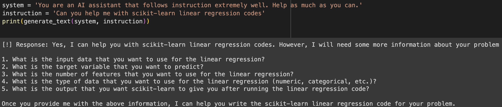
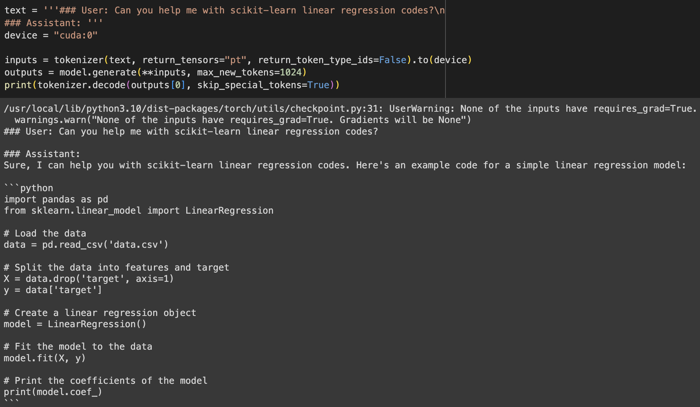

## AI Planet Large Language Model Bootcamp Challenge
A challenge from AI Planet's LLM bootcamp to (i) fine-tune pre-trained HuggingFace transformer model to build a Code Generation language model, and (ii) build a retrieval-augmented generation (RAG) application using LangChain

---

#### Part I: Fine-tuning [Orca Mini 3B](https://huggingface.co/pankajmathur/orca_mini_3b) on [evolved codealpaca](https://huggingface.co/datasets/theblackcat102/evol-codealpaca-v1) dataset to build a Code Generation model
Fine-tuning Orca Mini 3B with the evolved codealpaca dataset equips Orca Mini the ability to perform better on code generation tasks. 

When we asked Orca Mini to provide us codes for scikit-learn linear regression before fine-tuning was done, it requested for more information to be provided. 

After fine-tuning, the model is able to return a more targeted code generation completion output shown below.

---

#### Part II: Building a Retrieval-Augmented Generation (RAG) application using LangChain
A simple RAG to answer questions on the Battle Line game rules (PDF) using LangChain. We used the INSTRUCTOR embeddings model (ranked highly on the Massive Text Embeddings Benchmark, [MTEB](https://huggingface.co/spaces/mteb/leaderboard) leaderboard) for performing semantic retrieval and a quantized version of the impressive [Mistral 7B](https://mistral.ai/product/) for returning the completion output. 

Example of a RAG output:

---

## Getting started
Open `AI Planet LLM Bootcamp Challenge.ipynb.ipynb` on a jupyter notebook environment. Alternatively, you can view the codes in . The notebook consists of further technical details.
